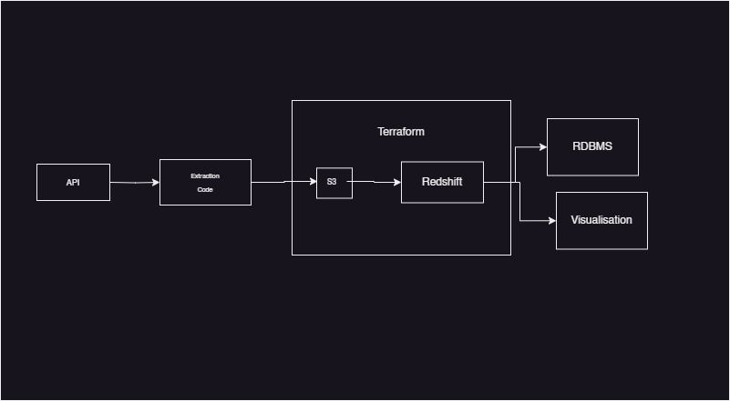

# Weather Data Engineering Project ☁️🌦️🌞

This project involves collecting weather data from the [OpenWeather API](https://openweathermap.org/api), storing it in an S3 bucket, and then ingesting into Redshift for analysis

## Project Overview




The project follows these main steps:

1. **Data Collection**: Utilizing Python, data is retrieved from the OpenWeather API.

2. **Infrastructure Setup**: Terraform is used to provision an S3 bucket and a Redshift cluster along with its associated database.

3. **Data Storage**: The collected weather data is saved into a CSV file and persisted in the S3 bucket.

4. **Data Processing**: Using Redshift, SQL queries are written to create a table within the Redshift database and load data from the S3 bucket into this table.

## Project Structure

The project is structured as follows:

- `extract.ipynb`: Contains the Python script for extracting data from the OpenWeather API.
- `main.tf`: Contains Terraform configurations for provisioning the S3 bucket and Redshift resources.
- `weather_data.csv`: Directory for storing the CSV file containing weather data.
- `warehouse_sql_script.sql`: SQL scripts for creating tables and loading data into Redshift.

## Prerequisites

- Python 3.x
- Terraform
- AWS account with appropriate permissions
- Open Weather API key

## Setup

1. **Clone the repository:**

   ```bash
   git clone https://github.com/Dokodi/Data-Engineering-Capstone-Project.git
   ```

2. **Install dependencies:**

   ```bash
   pip install -r requirements.txt
   ```

3. **Set up Terraform:**

   ```bash
   cd terraform/
   terraform init
   ```

4. **Deploy infrastructure:**

   ```bash
   terraform apply
   ```

## Usage

1. **Run the Python script to collect weather data:**

   ```bash
   python extract.ipynb
   ```

2. **Once the data is collected, upload the CSV file to the S3 bucket manually or through automation.**

```bash
   python to_s3.ipynb
   ```

3. **Access the Redshift console in AWS and execute the SQL scripts in the `warehouse_sql_script.sql` directory to create tables and load data from S3 into Redshift.**

## Contributors

- [Dokodi](https://github.com/Dokodi)

## Improvements
1. The whole process can be automated using an ochestrator like Airflow

## License

This project is licensed under the MIT License - see the [LICENSE](LICENSE) file for details.
